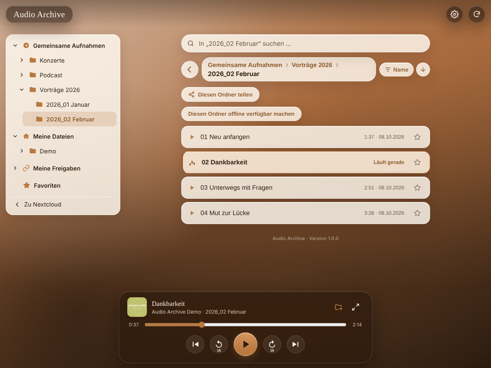

# Audio Archive

**Listen to audio recordings from a Nextcloud folder – installable as an app, works offline, shareable via link.**
**Audio-Aufnahmen aus einem Nextcloud-Ordner hören – als App installierbar, offline nutzbar, per Link teilbar.**



Audio Archive turns a folder of recordings in your Nextcloud – sermons, talks,
lectures, concerts, podcasts, rehearsals – into a simple player for everyone,
including listeners without a Nextcloud account.

## Features

- Browse the real folder structure, however deeply nested; search, sort
  (name, newest, shuffle), favourites
- Background playback with lock-screen and headset controls, resume where you
  stopped, continue with the next folder
- MP3, M4A/AAC, Ogg Vorbis, Opus, FLAC, WAV, WebM, AIFF; optional on-the-fly
  conversion to MP3 for devices that cannot play a format (needs `ffmpeg`)
- Installable as an app (PWA) on phones and desktops; save folders for
  offline listening
- Public link with password, plus links that users create for single folders
  (expiry date, own design, offline/download on or off)
- Comments and ratings per recording, overview and Excel export
- Own colours, background image and cover images, or Nextcloud's look
- "Help and contact" button that notifies a Nextcloud group

The user interface is currently **German only**. An English translation is
planned – help is welcome.

## Requirements

- Nextcloud 33–36, PHP 8.1 or newer
- Recommended: background jobs via **cron** (reads title/artist of large
  archives in the background)
- Optional: `ffmpeg` on the server for MP3 conversion

## Installation

From the Nextcloud App Store: *Apps → Multimedia → Audio Archive*.

Manually: extract the release archive into `custom_apps/` (folder
`audioarchive`) and enable the app under *Apps*.

## Setup

*Settings → Administration → Audio Archive*: choose the folder with the
recordings, optionally enable the public link and set a password, adjust the
design. Users open the player from the app menu; listeners without an account
use the public link.

## Removing the app

Disabling the app keeps all data. To delete everything the app stored
(shares, settings, cached data – recordings and comments are not touched):

```
occ audioarchive:remove-data --force
occ app:disable audioarchive
occ app:remove audioarchive
```

## Support

Bugs and ideas: [GitHub issues](https://github.com/minichhenoch-sir/Audio-Archive/issues).
Changes: [CHANGELOG.md](CHANGELOG.md). Developer notes (German):
[docs/ENTWICKLUNG.md](docs/ENTWICKLUNG.md).

## Licence

AGPL-3.0-or-later, see [LICENSE](LICENSE).
